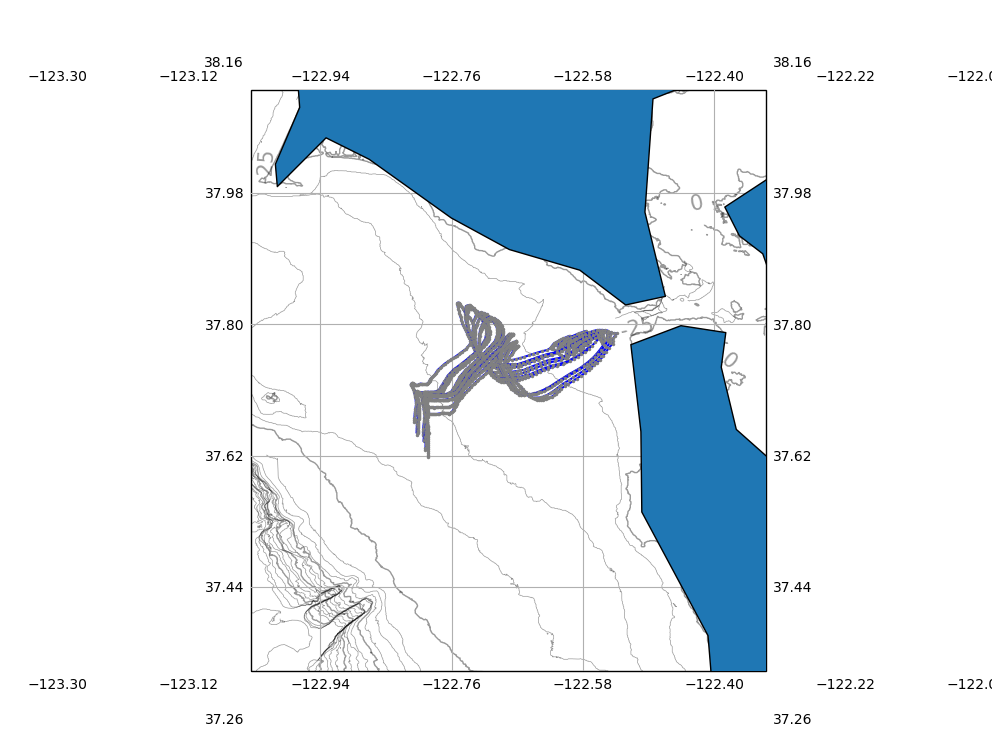

# CeNCOOS San Francisco Plume Tracker #

Fluvian discharge from rain events can cause plumes of freshwater to discharge from the San Francisco Bay, often transporting pollutants like fecal coliform to the nearby beaches.

Using a Lagrangian particle tracking model, based off of the [SCCOOS Tijuana River Plume Tracker](http://www.sccoos.org/data/tracking/IB/), plume trajectories can be modeled from High Frequency Radar (HFR) derived surface current measurements. This tool will allow users to access the impact on various beaches following a plume discharge event.

### The Model ###

High Frequency Radar is capable of measuring surface currents in near-realtime (~ hour delayed), because of its proximity to the coast line and its high resolution (500m, 2km, or 6km) it is a suitable tool for modeling how surface water masses advect around.

Advection is based on a [Runge-Kutta 4th Order](https://en.wikipedia.org/wiki/Runge%E2%80%93Kutta_methods) scheme, to approximate the position of a particle after a certain amount of time. This technique has been widely adopted for similar applications.

The time step can either be fixed or variable depending on the magnitude of the surface currents, in order balance the computational cost of the model against the particle positions that cross multiple grid points in a single timestep.

### The Code ###

The model is currently being ported into python, where it will continued to be developed, this code is found in the [python](./python/) directory.

For reference, the original Matlab code can also be found in the [matlab](./matlab/) directory, although it may not be developed any further.

### The Output ###

